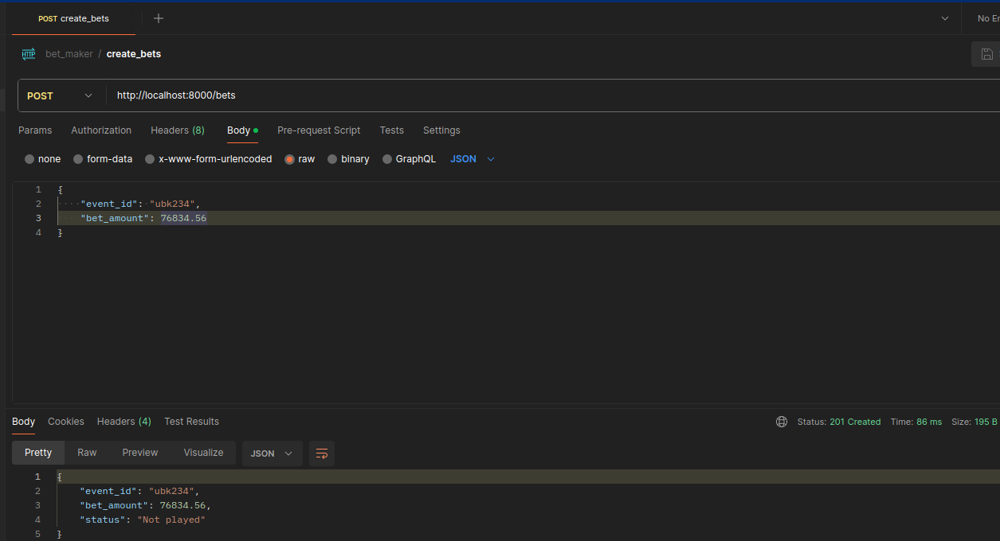
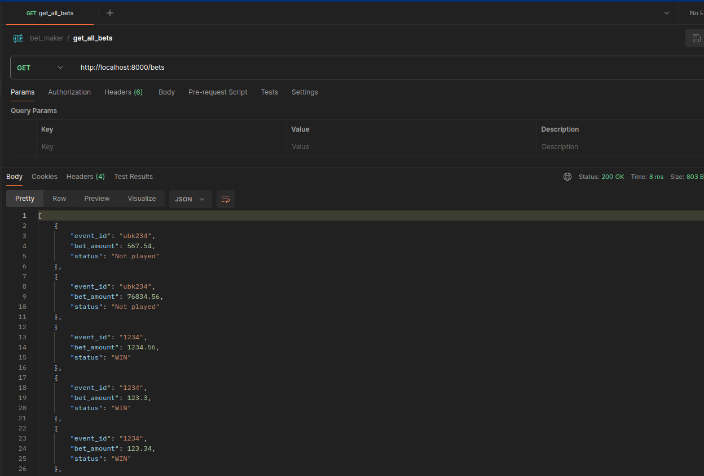
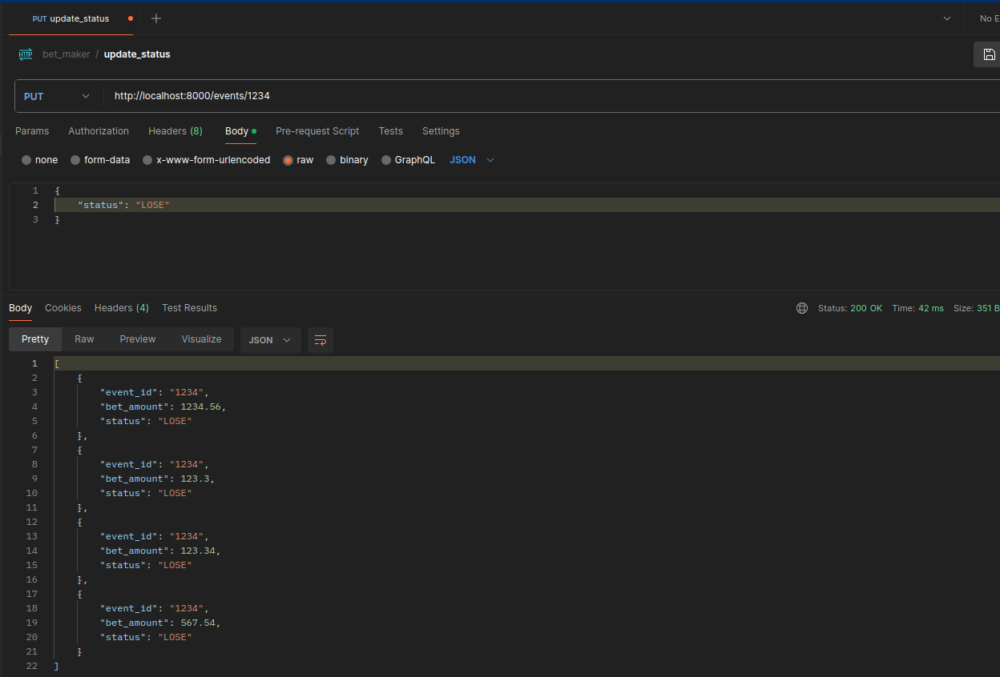

# bet-maker сервис

## API

1. ```POST /bets``` - совершить ставку на событие. Тело запроса: {event_id: str, bet_amount: decimal}
2. ```GET /bets``` - получить историю всех ставок.
3. ```PUT /events/{event_id}``` - обновить статусы всех ставок по event_id.Тело запроса: {status: str}

## ЗАПУСК
1. КЛОНИРУЕМ РЕПОЗИТОРИЙ, ПЕРЕХОДИМ В ДИРЕКТОРИЮ
2. устанавливаем зависимости: ```poetry install --no-root```


Docker:

через just:

``` just run```

``` just dtest``` - запустить тесты

через make:

``` make run```

```make dtest``` - запустить тесты

если через терминал:

``` docker compose up ```

Локально:

создаем ```.env``` файл в src директории и копируем переменные из ```.env.example``` и заполняем их

выполняем команду:

``` alembic upgrade head``` или ``` just migrate ```

выполняем команду:

```uvicorn src:init_app --reload``` или ``` just runl ```

## ПРИМЕРЫ

POST


GET


PUT

